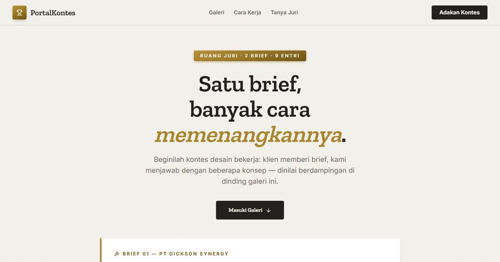

# PortalKontes — Galeri Entri Kontes Desain Web

PortalKontes: galeri entri kontes desain web — beberapa konsep untuk satu brief, dinilai berdampingan seperti di ruang juri.

**Demo live:** https://portal-kontes.vercel.app



> Katalog demo milik PintuWeb. Setiap kartu menautkan ke demo live yang bisa dicoba.

## Konsep

"Ruang Juri": galeri entri kontes desain dengan bingkai galeri, mat putih, dan plakat kuningan untuk setiap entri.

## Varian yang dipamerkan (9)

- [EthyleneAbsorber](https://absorber-dickson.vercel.app)
- [EthyleneAbsorber](https://absorber-divine.vercel.app)
- [EthyleneAbsorber](https://absorber-premium.vercel.app)
- [EthyleneAbsorber](https://absorber-segar.vercel.app)
- [Positive Crave](https://crave-amber-mu.vercel.app)
- [Positive Crave](https://crave-close.vercel.app)
- [Positive Crave](https://crave-grace.vercel.app)
- [Positive Crave](https://crave-lumen.vercel.app)
- [Positive Crave](https://crave-noir.vercel.app)

## Halaman

`/`

## Teknologi

- Next.js 15.5 (App Router) dan React 19
- Tailwind CSS v4
- JavaScript
- Framer Motion, Lucide (ikon)
- Font: Zilla Slab, Inter (next/font)
- SEO: metadata per halaman, Open Graph, JSON-LD, sitemap.xml, dan robots.txt

## Menjalankan secara lokal

```bash
npm install
npm run dev
```

Buka http://localhost:3000. Untuk build produksi: `npm run build` lalu `npm start`.

---

Dibuat oleh [PintuWeb](https://www.pintuweb.com), jasa pembuatan website.
